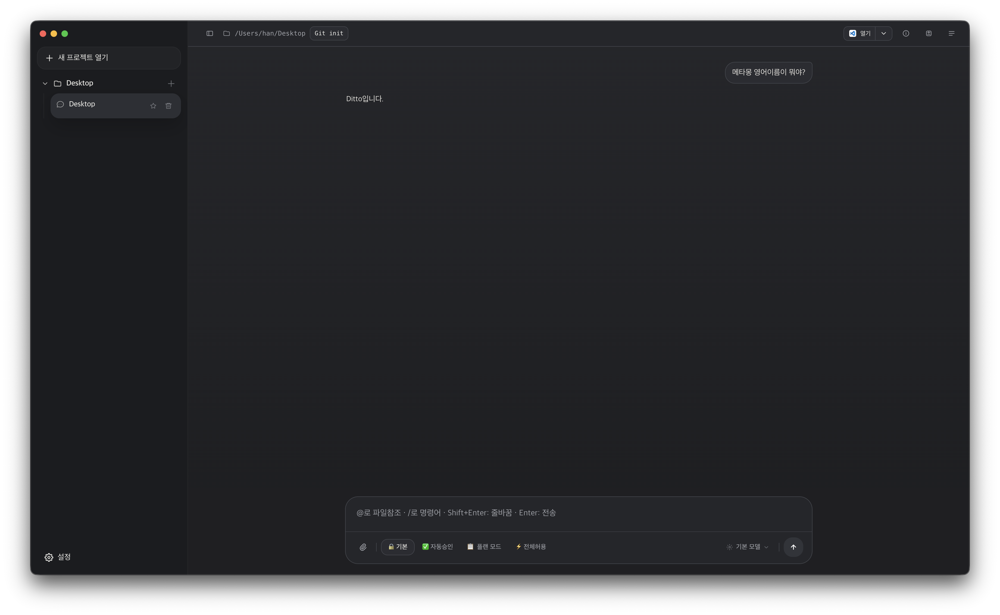

<p align="center">
  
</p>

<pre align="center">
 ██████╗██╗████████╗████████╗ ██████╗      ██████╗ ██████╗ ██████╗ ███████╗
██╔════╝██║╚══██╔══╝╚══██╔══╝██╔═══██╗    ██╔════╝██╔═══██╗██╔══██╗██╔════╝
██║     ██║   ██║      ██║   ██║   ██║    ██║     ██║   ██║██║  ██║█████╗
██║     ██║   ██║      ██║   ██║   ██║    ██║     ██║   ██║██║  ██║██╔══╝
╚██████╗██║   ██║      ██║   ╚██████╔╝    ╚██████╗╚██████╔╝██████╔╝███████╗
 ╚═════╝╚═╝   ╚═╝      ╚═╝    ╚═════╝      ╚═════╝ ╚═════╝ ╚═════╝ ╚══════╝
</pre>

Citto Code는 `Claude Code CLI`를 터미널 대신 앱 화면으로 사용할 수 있게 만든 데스크톱 앱입니다.

복잡한 명령어를 외우지 않아도, 프로젝트 폴더를 열고 채팅하듯 요청하면 코드 설명, 수정, 파일 탐색, Git 확인 같은 작업을 한 곳에서 진행할 수 있습니다.

Citto는 어떤 "변신하는 포켓몬 🟣"과 어떤 "AI 코딩 어시스턴트 🤖"에서 영감을 받았습니다.

아래는 실제 사용 화면 예시입니다.

<p align="center">
  
</p>

문서 작성 기준 확인된 사용 환경:

- Node.js `22.21.1`
- npm `10.9.4`
- Claude Code CLI `2.1.71`

## 이런 분께 맞습니다

- 터미널보다 앱 화면이 더 편한 분
- 프로젝트별로 대화를 나누고, 수정 전 확인을 받고, 변경 파일을 눈으로 보고 싶은 분

## 앱에서 할 수 있는 일

- 프로젝트 폴더를 열고 세션별로 작업 시작
- 파일을 첨부하거나 파일 내용을 불러와서 질문
- 자연어로 코드 설명, 버그 찾기, 기능 추가 요청
- 수정 전 권한 확인, 자동 편집 허용, 플랜 모드 전환
- Claude 모델 선택
- 변경 파일과 Git diff 확인, 브랜치 전환, 커밋/푸시/풀
- MCP, Skill, Agent, 환경변수 설정 관리
- 기본 프로젝트 폴더, 테마, 알림, 단축키 설정

## 설치 전에 준비할 것

- 가능하면 Node.js `22.x`와 npm `10.x`를 사용하세요.
- Claude Code CLI가 설치되어 있고 로그인까지 끝나 있어야 합니다.
- 터미널이나 PowerShell에서 `claude --version`이 정상 동작해야 합니다.

앱은 Claude Code CLI를 직접 포함하지 않습니다. Claude CLI가 없으면 앱 실행 시 설치 안내가 표시됩니다.

## macOS 설치 방법

프로젝트를 내려받은 뒤, 해당 폴더에서 터미널을 열고 아래 순서대로 실행하면 됩니다.

```bash
npm install
npm run install:mac
```

설치가 끝나면:

- `/Applications`에 쓸 수 있으면 그 위치에 설치됩니다.
- 권한이 없으면 `~/Applications`에 설치됩니다.
- 앱 이름은 `Citto Code`입니다.

처음 실행할 때 macOS 보안 경고가 나오면, 시스템 설정에서 실행을 허용해야 할 수 있습니다.

## Windows 설치 방법

프로젝트를 내려받은 뒤, 해당 폴더에서 PowerShell을 열고 아래 순서대로 실행하면 됩니다.

```powershell
npm install
npm run install:win
```

설치가 끝나면:

- `%LOCALAPPDATA%\Programs\Citto Code`에 설치됩니다.
- 바탕화면과 시작 메뉴에 바로가기가 생성됩니다.

회사 PC 정책에 따라 Windows SmartScreen 경고가 나올 수 있습니다.

## 설치 후 바로 쓰는 방법

1. `Citto Code`를 실행합니다.
2. 새 세션을 열면 프로젝트 폴더를 선택할 수 있고, 선택하지 않으면 기본 프로젝트 폴더에서 바로 시작합니다.
3. 이미 열린 세션에서 다른 폴더로 작업하고 싶으면 앱 안에서 `프로젝트 폴더 선택`을 누르면 됩니다.
4. 설정에서 기본 프로젝트 폴더를 원하는 위치로 바꿀 수 있습니다.

## 자주 겪는 문제

### 앱이 Claude Code를 찾지 못한다고 나올 때

Claude Code CLI가 설치되어 있지 않거나, PATH에 잡혀 있지 않은 경우입니다.

터미널에서 아래 명령이 되는지 먼저 확인하세요.

```bash
claude --version
```

### 설치는 됐는데 앱이 바로 안 열릴 때

- macOS: 보안 경고 때문에 첫 실행이 막힐 수 있습니다.
- Windows: 회사 보안 정책 또는 SmartScreen 때문에 확인 창이 뜰 수 있습니다.
